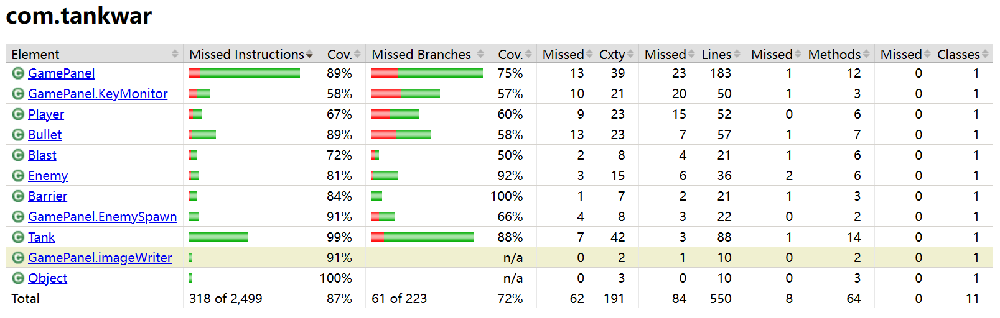

##### 项目介绍
主体为简易的坦克大战，玩家控制坦克对抗随时间生成的敌方坦克。

##### Junit单元测试覆盖率：
详细见：target\jacoco-report\index.html

##### 并发测试：
线程控制敌人移动和攻击：  

生成敌人并启动其线程：  

录屏链接：(https://www.bilibili.com/video/BV1wC4y1Z7PC?p=6)  
##### IO测试：
1. 地图、进度的保存：  

2. 回放：将`JFrame`的每次`repaint`的`image`转为二进制`byte[]`，加入准备好的`List<byte[]>`中，转为二维数组`byte[][]`后存入文件中，异步后台线程进行

录屏链接：(https://www.bilibili.com/video/BV1wC4y1Z7PC?p=7)  
##### 网络通信测试：
暂未完成，服务器端将image转为字节流传至客户端后无法再转换为image。